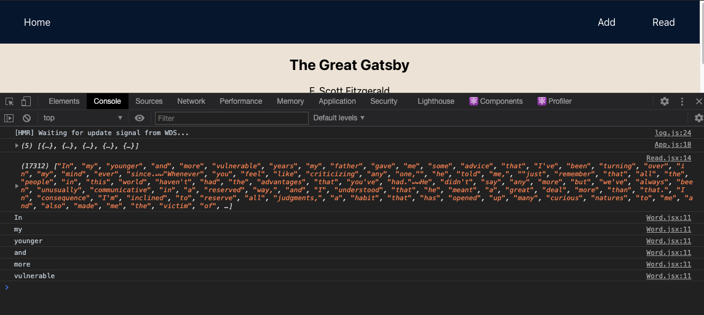

# PROJECT ISSUE TICKET

## Unexpected Behavior

React's double rendering is conflicting with the setinterval and is pulling 2 words instead of one whenever the interval is called. I also cannot figure out how to stop the display of words with clearSetInterval because of scoping issues.

## Expected Behavior

When a play button is pressed, a single word from the array of words is printed in a <div/> on screen every 200 miliseconds.

## Reproduce the Error

> Describe the steps we can take to reproduce the error, i.e.:

```md
1. clone
2. run start
3. click on "Read" button on nav
4. Endless display of words double rendered with no stop
```

## Documentation



## Attempted Resolution

> If you haven't already, **Google your error message now**. See if those error messages return an answer. Include at least 2 resources you've tried to consult such as walk-throughs, stack overflow articles, and other discussion threads related to your error.

```md
link 1. https://andreasheissenberger.medium.com/react-components-render-twice-any-way-to-fix-this-91cf23961625
```
