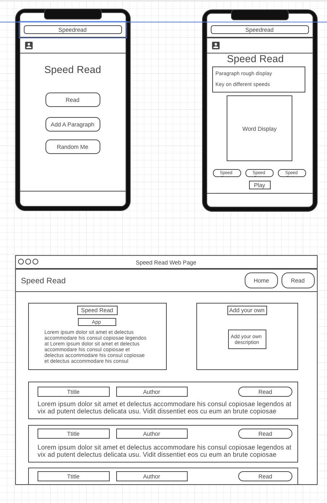

# Speed Read

DEPLOYED URL HERE

## Project Description

For the generation invested in technology and the advances it brings, something as old school as reading a book has increasingly become out of touch. In the age of Google and Wikipidea, there is no lack of information. But the reading aspect of it has yet to evolve. This app revolutionizes the primitive way of reading and trains your cognative ability to comprehend words at a faster rate. Statistically speaking, learning something is done most effectively at 200 words per min, understanding at 400 words per min, and revising at 600 words per min. Speed Read lets you control the flow of information, suited and customized to your needs and abilities. 

## Wireframes



## Component Hierarchy

COMPONENET HIERARCHU HERE

## Code Snippet

CODE SNIPPET HERE

## API and Data Sample

LINK TO AIRTABLE HERE

This project uses the Airtable CMS and returns data in JSON format as follows:

```
{
    JSON FORMAT OF DATA HERE
}

```

### MVP/PostMVP

#### MVP

- MVPS HERE

#### PostMVP

- POST MVPS HERE

## Project Schedule

| Day       | Deliverable                                | Status     |
| --------- | ------------------------------------------ | ---------- |
| Feb 12-16 | Proposal and Project Approval              | Incomplete |
| Feb 17    | ////////////////////////////////////////// | Incomplete |
| Feb 18    | ////////////////////////////////////////// | Incomplete |
| Feb 19    | ////////////////////////////////////////// | Incomplete |
| Feb 20    | ////////////////////////////////////////// | Incomplete |
| Feb 22    | ////////////////////////////////////////// | Incomplete |

## Timeframes

| Component                 | Priority | Estimated Time | Time Invested | Actual Time |
| ------------------------- | :------: | :------------: | :-----------: | :---------: |
| Airtable setup            |    H     |      1hr       |      ---      |     ---     |
|                           |    H     |      ---       |      ---      |     ---     |
|                           |    H     |      ---       |      ---      |     ---     |
|                           |    H     |      ---       |      ---      |     ---     |
|                           |    H     |      ---       |      ---      |     ---     |
| Total                     |    H     |      ---       |      ---      |     ---     |

## SWOT Analysis

### Strengths:


### Weaknesses:


### Opportunities:


### Threats:


