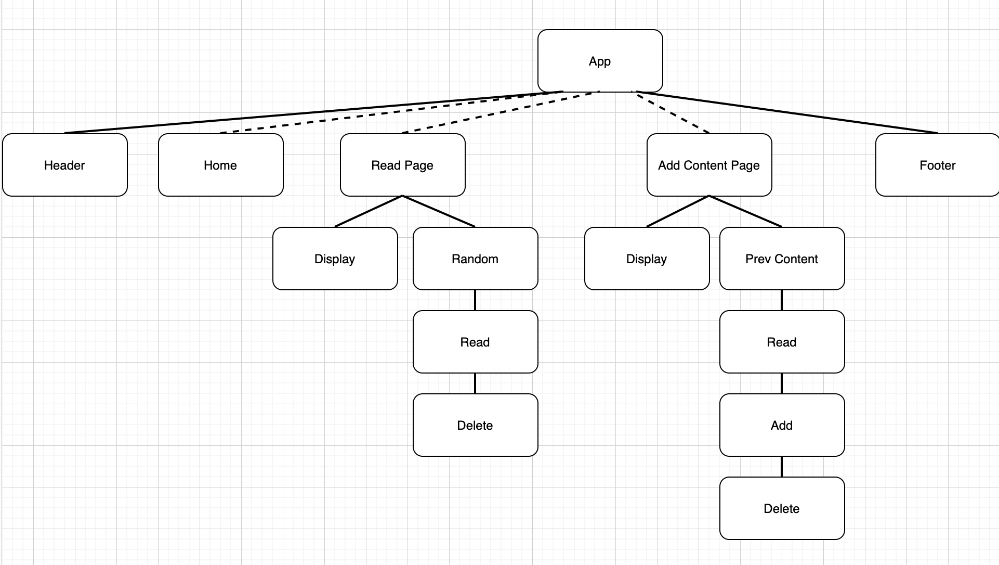

# Speed Read

DEPLOYED URL HERE

## Project Description

For the generation invested in technology and the advances it brings, something as old school as reading a book has increasingly become out of touch. In the age of Google and Wikipidea, there is no lack of information. But the reading aspect of it has yet to evolve. This app revolutionizes the primitive way of reading and trains your cognative ability to comprehend words at a faster rate. Statistically speaking, learning something is done most effectively at 200 words per min, understanding at 400 words per min, and revising at 600 words per min. Speed Read lets you control the flow of information, suited and customized to your needs and abilities. 

## Wireframes


## Component Hierarchy



## Code Snippet

CODE SNIPPET HERE

## API and Data Sample

This project uses the Airtable CMS and returns data in JSON format as follows:

```
{
records: [
{
id: "recQRJmCuUDMR9lFQ",
fields: {
isbn: "0553213105",
title: "Pride and Prejudice",
pages: "311",
author: "Jane Austen",
content: "It is a truth universally acknowledged, that a single man in possession of a good fortune, must be in want of a wife. However little known the feelings or views of such a man may be on his first entering a neighbourhood, this truth is so well fixed in the minds of the surrounding families, that he is considered the rightful property of some one or other of their daughters. “My dear Mr. Bennet,” said his lady to him one day, “have you heard that Netherfield Park is let at last?” Mr. Bennet replied that he had not. “But it is,” returned she; “for Mrs. Long has just been here, and she told me all about it.” Mr. Bennet made no answer. “Do you not want to know who has taken it?” cried his wife impatiently. “You want to tell me, and I have no objection to hearing it.” This was invitation enough. “Why, my dear, you must know, Mrs. Long says that Netherfield is taken by a young man of large fortune from the north of England; that he came down on Monday in a chaise and four to see the place, and was so much delighted with it, that he agreed with Mr. Morris immediately; that he is to take possession before Michaelmas, and some of his servants are to be in the house by the end of next week.” “What is his name?” “Bingley.”...
},
createdTime: "2021-02-16T00:20:11.000Z"
},

```

### MVP/PostMVP

#### MVP

- Functioning Route/Link NavBar
- Interactable Form
- Create, Read and Delete functionality
- Constantly updated API 
- Content Display 1 word at a time at 200 words per min
- Play/Pause button

#### PostMVP

- Update Functionality
- Additional display timing, 400wpm and 600wpm
- Client based Storage of data
- Profile Page

## Project Schedule

| Day       | Deliverable                                | Status     |
| --------- | ------------------------------------------ | ---------- |
| Feb 12-16 | Proposal and Project Approval              | Incomplete |
| Feb 17    | Skeleton of Routes and Links               | Incomplete |
| Feb 18    | Incorporating API information              | Incomplete |
| Feb 19    | CRUD Implementation and Content Layout     | Incomplete |
| Feb 20    | CSS and Styling                            | Incomplete |
| Feb 22    | MVP Completion                             | Incomplete |

## Timeframes

| Component                               | Priority | Estimated Time | Time Invested | Actual Time |
| --------------------------------------- | :------: | :------------: | :-----------: | :---------: |
| Airtable setup                          |    H     |      1hr       |      ---      |     ---     |
| Skeleton and Route/Link setup           |    H     |      1hr       |      ---      |     ---     |
| Setting up Airtable API                 |    H     |      2hrs      |      ---      |     ---     |
| Home Page content layout                |    H     |      1.5hrs    |      ---      |     ---     |
| API Fetching Data                       |    H     |      1hr       |      ---      |     ---     |
| API Create Operation                    |    H     |      2hrs      |      ---      |     ---     |
| Form Page content layout                |    H     |      2hrs      |      ---      |     ---     |
| API Read Operation                      |    H     |      1hr       |      ---      |     ---     |
| Timing and interaction buttons          |    H     |      3hrs      |      ---      |     ---     |
| 200 words per min timing setup          |    H     |      1hr       |      ---      |     ---     |
| 400 words per min timing setup          |    H     |      1hr       |      ---      |     ---     |
| 600 words per min timing setup          |    H     |      1hr       |      ---      |     ---     |
| API Update Operation                    |    H     |      1.5hrs    |      ---      |     ---     |
| API Delete Operation                    |    H     |      1.5hrs    |      ---      |     ---     |
| Random content page layout              |    H     |      1.5hrs    |      ---      |     ---     |
| Form interaction                        |    H     |      2hrs      |      ---      |     ---     |
| CSS Styling and aesthetic content setup |    H     |      5hrs      |      ---      |     ---     |
| Streamlining code and organization      |    H     |      2hrs      |      ---      |     ---     |
| Total                                   |    H     |      33hrs     |      ---      |     ---     |

## SWOT Analysis

### Strengths:


### Weaknesses:


### Opportunities:


### Threats:


